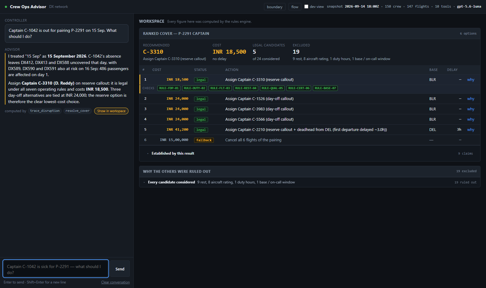
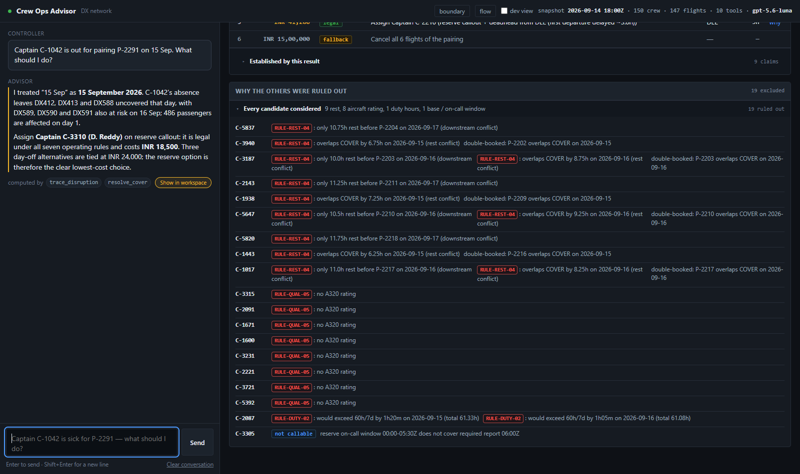

# Crew Ops Advisor

A decision-support tool for an airline crew-control desk. A controller describes
a disruption in their own words; the system says who can legally cover it, what
each option costs, and why everyone else was ruled out.

**The architectural claim:** deterministic Python computes every figure. The
language model chooses which question to ask and explains the result. It may
propose anything, but it may only *state* what a validator returned — and that
is enforced by a gate, not by a line in a prompt. See
[docs/ARCHITECTURE.md](docs/ARCHITECTURE.md).



A captain is lost two hours before report. The recommendation, its cost, and
the seven rules that cleared it — every figure on that screen was computed by
Python, and the model could not have written one that was not.



All nineteen candidates that were ruled out, each carrying the rule that
stopped them. C-3305 is marked *not callable* rather than illegal: being
outside an on-call window breaks no rule, and a controller who confuses the two
makes the wrong call.

More in [screenshots/](screenshots/) — the boundary diagram, the duty-week
timeline with its rest gap, the joint plan for two simultaneous sick calls, and
the drill-down that answers "why not them?"

## Where it stands

| Measurement | Result |
| --- | --- |
| The 38 questions, through the engine | **36 / 36 gradable pass** (2 are rubrics, not values, and are never counted as passes) |
| The 6 worked scenarios | **19 / 19 checks pass**, including S2's 19 exclusions byte for byte |
| Agent loop and claim gate | **28 / 28 tests pass** |
| The workspace, in a headless browser | **119 / 119 DOM checks pass** |
| Two outside reviews, their own regressions | **9 / 13 pass**; the other 4 are [findings we rejected](docs/REVIEW_DISPOSITION.md) because they contradict the published answer keys |
| The 38 questions, *through the agent* (gpt-5.6-luna) | Last full browser sweep: **38 / 38 answered**, no console errors. That sweep predates the current claim gate, which is stricter — see [docs/ISSUES.md](docs/ISSUES.md). |

One caveat worth stating plainly: the engine score checks whether each expected
value appears in the tool results, which is retrieval and routing coverage. It
is not a judgement that the sentence the controller reads is the right one.

```bash
python -m aircrew.scoreboard          # the engine number, no model required
python -m tests.test_agent_loop       # the gate and the loop
node tests/ui_check.js                # the workspace and chat pane (needs jsdom)
```

## Setup

Python 3.10+. No dependencies, anywhere, including the chat pane.

```bash
git clone <this repo> && cd aircrew-agent
python -m aircrew.scoreboard          # should print 36/36 and 19/19
python -m aircrew.server              # http://127.0.0.1:8765
```

For the chat pane, an OpenAI-compatible endpoint. Still no dependencies: the
loop posts to `/chat/completions` over the standard library.

```bash
export AIRCREW_API_KEY=...
export AIRCREW_MODEL=gpt-5.6-luna     # default
export AIRCREW_BASE_URL=...           # default https://api.openai.com/v1
python -m aircrew.server
```

Without a key the server says so and the workspace runs on the engine alone —
every recovery the product can recommend is still reachable, from the buttons in
the UI or from the CLI.

```bash
python -m aircrew.cli resolve  --pairing P-2291 --vacated-by C-1042
python -m aircrew.cli resolve  --pairing P-2291 --vacated-by C-1042 --exclude C-3310
python -m aircrew.cli check    --crew C-5837 --pairing P-2291
python -m aircrew.cli delay    --aircraft VT-DXA --date 2026-09-16 --hours 1.5 --mode technical
python -m aircrew.cli closure  --station BLR --date 2026-09-17 --start 08:00 --end 14:00
python -m aircrew.cli timeline --crew C-3310 --pairing P-2291
```

## Deploying

The workspace deploys to Cloudflare Workers — the same engine, the same tools,
the same page, running with no filesystem and no model.

```bash
python worker/build.py
cd worker && npx wrangler deploy
```

The chat does not deploy. `Agent.ask` is synchronous and a Worker cannot block
on an outbound request, so `/api/chat` says so there rather than failing on the
first click. [worker/README.md](worker/README.md) has the detail.

## Layout

```
aircrew/
  data.py        loaders, indices, the Duty record
  rules.py       the seven rules; Finding carries numbers, render() carries words
  engine.py      impact, resolver, costing, ranking, joint search, recovery
  query.py       the typed Tier-1 lookups
  tools.py       9 tools; the claim envelope
  grounding.py   the claim gate
  agent.py       the loop, for an OpenAI-compatible model
  scoreboard.py  replays the 38 questions and 6 scenarios against the keys
  replay.py      replays the 38 questions THROUGH THE AGENT
  cli.py         the engine from a terminal, no model
  server.py      stdlib HTTP; /api/tool and /api/chat
web/index.html   the two-pane workspace, no build step
docs/            architecture, samples, build notes, deck
```

## Approach

**The harness came first.** `scoreboard.py` existed before the rules did, and
almost every finding below was found by running it. Its entries are thin
adapters over the engine; if one of them ever computes something itself, the
scoreboard has stopped testing the system.

**The rules were derived from the answer keys, not assumed.** The generator is
absent by design, so each of these was reverse-engineered and then verified
against all 150 crew or all six scenarios:

- **Accrual is additive.** `duty_hours_7d` and `flight_hours_28d` are
  `daily_history` *plus* the roster, on every day including the snapshot day —
  11 crew carry different nonzero values in each source on 2026-09-14 and the
  published field is their sum. Adding reproduces the published field for
  **150/150** crew; anything that de-duplicates does not. There is no dedupe
  flag, because there is nothing to de-duplicate.
- **The deadhead rule.** A positioned crew member is available from the next
  whole hour after the deadhead arrives, and report is one hour before
  departure. DX402 arriving 08:45Z therefore gives a 09:00Z report and a 10:00Z
  departure. That single rule produces the 3.0h delay in Q31/S2, the 7.0h in S5
  and both the 6.5h and 6.0h in S6, and it is also why the on-call window is
  tested against 09:00Z rather than the rostered 06:00Z.
- **Positioning is priced.** Callout + deadhead fee + the delay it causes.
  `18500 + 6500 + 3.0×5400 = 41200`, which is why an out-of-base reserve ranks
  below an in-base day-off callout.
- **Exclusion reporting stops at the first failing rule**, and reports every
  finding under it. A candidate who fails the rating *and* rest is excluded on
  the rating; a candidate with two duty-hour breaches gets both, joined `"; "`.
- **Rest findings are named after the duty that follows the gap** — `COVER
  (rest conflict)` when the cover is squeezed, the pairing id
  `(downstream conflict)` when the cover squeezes something else. A negative gap
  is stored signed and paired with a `double-booked:` finding. A human is never
  shown a negative rest figure; the timeline renders it as an overlap.
- **Check order is load-bearing:** base → rating → certification → FDP → rest →
  7-day duty → 28-day block, with the on-call window gating candidate selection
  ahead of all of them. The window is *not* a rule breach, which is how Q24 and
  S2 can key on different reasons for the same person.

**Scaffolding was earned, not assumed.** The runtime target is capable, so the
system prompt carries only rules that pay for themselves: what the model owns,
how to write a figure, and what it uniquely adds (ambiguity, which verdict was
asked, ties). There is no push-back heuristic for a model that announces a tool
instead of calling it — that belongs in the "add only if measured" pile, and it
has not been measured.

**Nine tools, not seventeen.** The seventeen in the brief are the question list
projected onto function names; most Tier-1 entries are one `SELECT … WHERE` and
several Tier-2/3 entries are the same engine primitive dressed differently.
Collapsing lookups into `lookup(entity, …)` and the what-ifs into
`simulate_disruption(kind, …)` gives the model fewer things to route between and
leaves the code as one engine with a few entry points. The design notes that
were load-bearing all survive: `check_assignment` still returns two verdicts,
`trace_disruption` is still separate from `resolve_cover` so "which flights are
uncrewed?" cannot trigger a 150-candidate ranking, and exclusions still live
inside the resolve result.

## Honest trade-offs

**The agent number is lower than the engine number, and it moved a lot.** The
first run through `gpt-5.6-luna` scored **21/38**. Fixing what that exposed — all
of it in this codebase, none of it in the model — took it to 32/38 as reported,
and to **35/36 gradable** once the scorer itself was fixed. The remaining failure
is a routing miss on Q27. Three fixes landed after the last full run and are not
live-verified; **run `python -m aircrew.replay` before quoting any number.**

The agent-level failures were almost all tool-surface defects invisible from the
engine: a model that fills every optional parameter with `""`, a hallucinated
year that made a closure return "0 flights affected" (wrong, but grounded), and
a tool that the 17→9 collapse had silently dropped. Two more were the *scorer*,
which escaped the answer keys' em dash and so could never match two correct
answers. Details in [docs/ISSUES.md](docs/ISSUES.md).

**The claim gate matches figures, not meaning.** A number is accepted if it
appears anywhere in this turn's tool results. So "the delay costs 486" passes
when 486 is that turn's passenger count. The gate catches invention, which is
the dangerous failure; it does not catch a figure attached to the wrong label.
Making it stricter would need the model to cite a claim id for every figure, and
a gate that fires on correct answers gets switched off.

**One case the system handles poorly** — a paid callout for someone already
working the pairing — is documented with analysis in
[docs/SAMPLES.md](docs/SAMPLES.md#e-a-case-the-system-handles-poorly). Two more
places where the reference contradicts itself, and everything that was tried and
thrown away, are in [docs/NOTES.md](docs/NOTES.md).

**Cross-checked against `main`,** a complete independent implementation of the
same brief with no common ancestor. Across all 156 (pairing, role) vacancies the
**rank-1 recommendation is identical in 156/156** and the full ranked list in
105/156; every remaining difference is `main` offering the sole incumbent of a
vacant role as a candidate to cover their own vacancy. Detail in
[docs/NOTES.md §8](docs/NOTES.md#8-compared-with-main).

**Two of the seven rules never eliminate anybody.** Across all 156 (pairing,
role) vacancies in the roster, RULE-FDP-01 and RULE-FLT-03 produce zero
exclusions — the maximum 28-day block in the whole dataset is 79.28h against a
100h limit. Both are still reported in `rules_checked` because the keys require
it, but "we checked seven rules" would overstate what happened. Measurements in
[docs/NOTES.md §3](docs/NOTES.md#3-the-surprise-which-rules-actually-bind).

**Ten tools, not nine.** `earliest_next_report` was added back after the replay
showed Q23 was unanswerable without it — the earned-scaffolding rule working in
reverse.

**Two questions have rubrics for answer keys** (Q36, Q38). They are marked
`GEN` and never counted as passes; grading a rubric against itself is a fake
pass. The honest denominator is 36, not 38.

**The half-open closure interval is an assumption.** No flight in this dataset
sits on a closure boundary, so inclusive and half-open bounds give identical
output on Q19, Q29 and S3. The half-open reading is implemented because it is
the conventional one, but the data does not settle it.

**Positioning considers same-day nonstop deadheads only.** No multi-hop routing
and no next-day positioning. Every case in the dataset is a single nonstop leg,
so this is untested beyond it.

**The workspace is one page and one theme.** Dark only, deliberately: this desk
is staffed overnight. A theme toggle that half-worked would be worse than one
committed theme, so there is no toggle.
